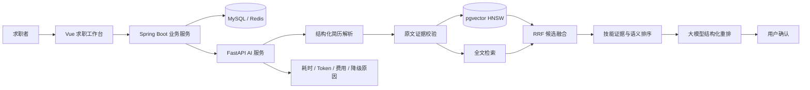

# 架构设计与可解释决策链路

## 服务边界

- Vue 负责简历上传、能力画像确认、匹配解释和求职计划展示。
- Spring Boot 负责登录、职位与反馈数据、用户权限和事务。
- FastAPI 负责文档解析、能力画像、排序、解释和离线评测。
- MySQL 保存业务数据，Redis 承担短期状态；pgvector 持久化岗位向量，并通过 HNSW 与全文索引完成候选召回。

业务服务与 AI 服务通过内部 API 和独立密钥连接。这样可以单独迭代匹配算法，也能限制 AI 服务直接接触用户身份和业务事务。

## 混合召回与模型重排

1. 把简历解析为可编辑的能力画像，用户确认后才重新匹配。
2. 确定性基线从岗位描述中提取技能，并计算文本相关度、技能覆盖、目标方向和城市条件，保证结果可解释、可回退。
3. 配置模型服务和 pgvector 后，只为新增或内容变化的岗位更新 Embedding；在线请求通过 HNSW 与全文检索分别召回，再使用 RRF 合并候选。
4. 候选集结合语义相关度、技能证据和偏好进行排序，再由大模型在严格 Schema 和证据白名单内重排。
5. 大模型只在候选集内执行结构化重排，并返回相关度、说明、匹配技能和缺失技能。服务端会丢弃不在基线证据白名单中的技能，防止模型补写经历。
6. 对每个缺失技能计算“只补充这一项已验证技能”时的覆盖分增益，形成优先补强建议；求职计划只能重写已有事实。

在线链路支持三级降级：`LLM_RERANK → EMBEDDING → BASELINE`。模型重排失败时保留语义召回结果，Embedding 失败时返回确定性基线，页面会显示实际使用的推荐模式。

简历解析同样受证据约束：模型必须为技能和重要经历返回原文引用。服务端只保留能在上传文本中逐字定位的证据，并记录起止位置；模型不可用或结构校验失败时降级为规则解析并提示用户确认。

## 设计取舍

- 确定性基线用于复现、测试和离线演示；启用模型后使用 `hybrid-embedding-llm-rerank-v1`，同时保留每一级分数与决策轨迹。
- 单项补强收益仅来自技能覆盖权重，不把它包装成录用概率，也不推断无法验证的能力。
- 当前版本会在推荐请求中增量同步岗位；职位规模扩大后，应把同步过程拆成独立任务，并评估 Cross-Encoder 或学习排序模型。
- 公开评测集是脱敏回归样例，只能证明管线稳定；真实效果需要人工标注集和线上反馈实验。
