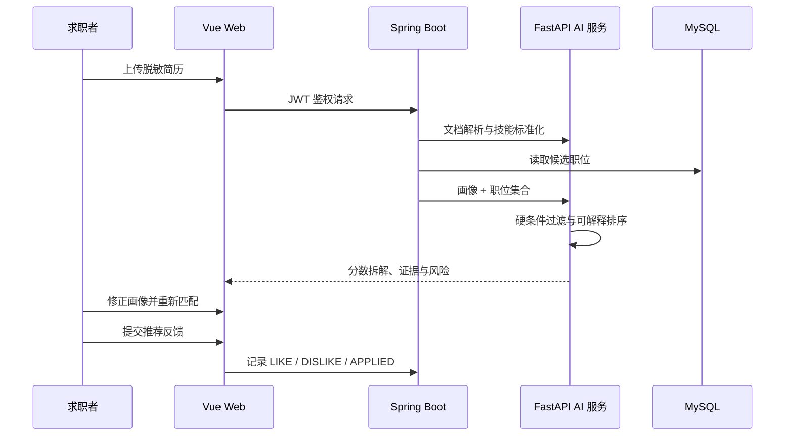

# 面试演示手册

## 推荐脚本（3—5 分钟）

1. 使用演示账号登录并打开 AI 求职助手。
2. 上传 `demo/AI应用开发实习生-脱敏简历.md`。
3. 展示结构化能力画像，删除一个误识别技能并添加一个简历中真实存在的技能。
4. 确认画像并重新匹配，解释语义、技能覆盖、岗位方向和硬条件四部分分数。
5. 展开匹配证据、缺失技能和风险提示。
6. 生成 60 天学习计划，并对职位提交“有帮助”或“已投递”反馈。

## 演示账号

- 用户名：`demo_candidate`
- 密码：`Demo@2026`

数据库首次初始化会写入 15 个覆盖 AI 应用开发、Agent、评测、产品、数据运营、后端和前端方向的脱敏职位。

## 核心链路

## 诚实边界

- 当前在线链路使用确定性的中文文本与技能混合排序，pgvector 是下一阶段的大规模召回基础设施。
- 当前职位是脱敏演示数据，不代表真实招聘岗位。
- AI 生成内容只提供求职准备建议，不自动替用户改写或编造经历。
